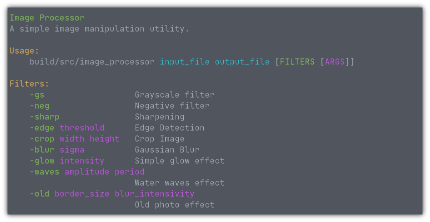

# image-processor

Educational project (HSE, Faculty of CS, AMI, C++ course): CLI image processor. Apply various filters from your command line!

P.S. The project is lincenced under the MIT License, which means you cannot copy or distribute modified files from the project without attribution. Don't try to plagiarize it.
